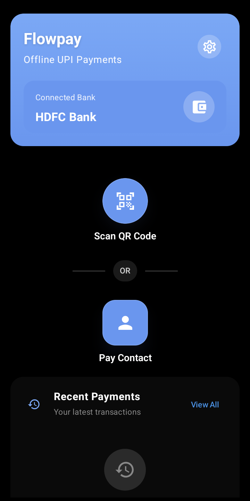

# Flowpay

*An Android app that brings UPI payments to users with no internet, using `*99#` USSD and UPI 123Pay (IVR) rails.*


Flowpay tackles a problem millions of people in India hit every day: UPI payments break the moment the internet drops. It puts a clean, smartphone-native UI on top of the offline payment rails — `*99#` USSD and UPI 123Pay — that already ship on every Indian phone but stay buried behind menus almost nobody uses.

<p align="center">
  
</p>

---

## What it does

Flowpay wraps the two offline UPI rails that already exist on every Indian smartphone but are buried behind UX so poor that almost nobody uses them:

- **`*99#` USSD flow** — dial the shortcode, navigate the menu, send money. Flowpay places the `*99#` call for the user and gives them a payment UI to start from, but it does **not** automate the menu walk or parse USSD responses — the in-app step-by-step USSD overlay was built and is currently disabled, so the user navigates the telco menu manually.
- **UPI 123Pay IVR flow** — the missed-call and call-based payment flow shipped in 2022 for feature phones. Flowpay invokes it from a smartphone with a thin wrapper around the call intent.
- **QR scan + manual entry as fallbacks** — both feed the same `*99#` flow downstream.

Both rails work without internet. Both are usable today on any Indian SIM with any UPI-linked bank account. No registration with Flowpay, no server, no account creation. The app is a client over rails that already exist.

**Flowpay uses no accessibility service** — it cannot read your screen or any other app. It never sees your UPI PIN, which is entered directly into your bank's IVR/dialer flow; the app only triggers the dialer and reads bank-confirmation SMS locally on the device.

## Prerequisites

To actually run a transaction end-to-end you need:

- An Android device running **Android 10 (API 29)** or higher
- An **Indian SIM** in slot 1 (with dual-SIM support optional)
- A **bank account linked to UPI** via the standard issuer process — same as any UPI app

## Why it was built

The starting question was simple: why do UPI payments fail in low-signal areas, and why does the smartphone UX collapse the moment internet drops out?

The official failure metrics — the publicly reported ~0.7–0.8% technical decline rate — count only transactions that reached a switch and got rejected. They don't count the much larger population: transactions that never initiated because the app couldn't reach the network. That invisible failure population is the actual problem worth solving.

UPI Lite, UPI Lite X, and 123Pay exist on paper as offline rails. In practice, Lite is a wallet (debit-only, no merchant flows for most use cases), Lite X is NFC-only and not meaningfully deployed at consumer scale, and 123Pay's IVR flow is unusable when you're holding a smartphone — nobody listens to voice menus when they could tap a button.

Flowpay brings these existing offline rails together behind a single smartphone-native UI, so paying without internet is something a user can actually do.

## Technical challenges

Building on telco-era rails comes with real constraints. These are the hard parts Flowpay works around:

**USSD is slow by design.** Each `*99#` interaction is a synchronous menu walk over GSM signalling — round trips take roughly a minute, and the menus aren't built for programmatic traversal, so the flow accounts for telco session timeouts and rate limits.

**123Pay's IVR was built for feature phones.** It expects a user holding a phone to their ear, so Flowpay wraps the dialer hand-off with an on-screen guide to keep the experience coherent on a smartphone.

**The rails don't expose a clean transaction lifecycle.** Neither flow hands the app a reliable success/failure callback, so Flowpay infers the outcome from the bank's confirmation SMS rather than from call state alone.


## Reading the code

```
app/src/main/java/com/flowpay/app/
├── MainActivity.kt              # home screen (Compose), entry to all payment flows
├── SetupActivity.kt             # first-run setup: bank, primary SIM, disclaimer
├── TestConfigurationActivity.kt # post-setup connectivity test
├── managers/
│   ├── CallManager.kt           # dials *99#, monitors call state, restores audio
│   └── PermissionManager.kt     # runtime-permission helper
├── receivers/
│   └── SimpleSMSReceiver.kt     # priority-999 SMS broadcast receiver
├── helpers/
│   ├── TransactionDetector.kt   # regex parsing of bank SMS across ~15 banks
│   └── MainActivityHelper.kt    # transfer orchestration + permission gating
├── services/
│   ├── CallOverlayService.kt    # 40s on-call confirmation overlay
│   └── FlowpayNotificationListener.kt  # supplemental SMS detection
├── features/qr_scanner/         # CameraX + ML Kit Barcode QR scanner
├── data/                        # Room entities + repositories (local-only)
├── constants/                   # app-wide constants
└── ui/                          # remaining Compose screens (transactions, settings, …)
```

The pieces worth reading if you're poking around:

- **`managers/CallManager.kt`** — handles the dialer interaction with `*99#`, including call-state monitoring and the timeout/retry logic that ended up being most of the complexity.
- **`helpers/TransactionDetector.kt`** + **`receivers/SimpleSMSReceiver.kt`** — the bank-SMS regex parsers. The hardest part of the project; every bank's receipt format is different.
- **`services/CallOverlayService.kt`** — the floating overlay shown during a USSD call so the user has a UI anchor instead of just the system dialer.
- **`AndroidManifest.xml`** — the permission set is deliberately small: phone, SMS, camera, overlay. Nothing else.

## Stack

- **Kotlin 2.1**, Jetpack Compose (Material 3)
- **Min SDK 29** (Android 10), **target/compile SDK 35**
- **Local-only persistence** in SQLite via Room
- **QR scanning** via Google ML Kit Barcode + CameraX
- No backend, no analytics, no telemetry, no third-party SDKs that talk to the internet

## Running it

```bash
git clone https://github.com/OWNER/REPO.git
cd REPO
echo "sdk.dir=$ANDROID_HOME" > local.properties
./gradlew installDebug
```

That's it. The build is self-contained — every dependency comes from public Maven repos.

First launch routes through Setup → connectivity test → home screen. The connectivity test will dial `*99#` once to verify the menu walk works on your operator + SIM, which may incur a small charge depending on your plan (Jio and Airtel are usually free on most plans; some prepaid plans charge a few paise per session).

If you want to skim the code without running it, the build also works without an Android device — `./gradlew assembleDebug` produces a working APK in `app/build/outputs/apk/debug/`.

See [CONTRIBUTING.md](CONTRIBUTING.md) for code style and PR conventions. See [SECURITY.md](SECURITY.md) for vulnerability disclosure.

## License

Apache License 2.0 — see [LICENSE](LICENSE) and [NOTICE](NOTICE).

You may use, modify, and redistribute this code under the terms of the Apache License 2.0. The license includes an explicit patent grant. There is no warranty of any kind.

---

## Legal & disclaimer

**Read this before using, forking, or building on the code. By doing any of those, you accept these terms.**


### No warranty

This software is provided under Apache License 2.0 **"AS IS, WITHOUT WARRANTIES OR CONDITIONS OF ANY KIND, either express or implied,"** including but not limited to warranties of merchantability, fitness for a particular purpose, non-infringement, accuracy, or reliability. See Section 7 of [LICENSE](LICENSE) for the full text.

### No affiliation

Flowpay is an independent open-source project. It is **not affiliated with, endorsed by, sponsored by, certified by, or connected to** any bank, telecommunications operator, payment processor, payment scheme operator, regulator, standards body, or government entity. References to public payment shortcodes, IVR numbers, or transaction rails are made strictly for descriptive and identification purposes.

### Your transactions are between you and your bank

When the app dials `*99#` or initiates an IVR call, **you are interacting directly with your telecom operator and your bank.** Flowpay does not see, store, transmit, intermediate, or modify your transaction data or your UPI PIN. The app only:

1. Triggers the dialer with a known public shortcode.
2. Reads incoming bank-confirmation SMS **locally on your device** for the sole purpose of showing you a transaction-result screen.

Any transaction outcome — success, failure, delay, double-debit, or loss — is **between you and your bank**, governed by your bank's terms of service and the applicable payment-scheme rules. The author of Flowpay accepts no liability whatsoever for any transaction outcome.

### User responsibility & compliance

You are solely responsible for ensuring your use of this software complies with all applicable laws and regulations, including but not limited to telecommunications regulations, financial-services regulations, KYC/AML rules, data-protection laws, and your bank's and operator's terms of service. If your jurisdiction restricts USSD-based payments, automated dialler use, or SMS reading, do not use this software there.

### Telecom and bank charges

Dialling `*99#` and initiating IVR calls may incur charges from your telecom operator. UPI transactions themselves may incur charges depending on your bank's policies. Flowpay does not subsidise, refund, or have visibility into any such charges. Check with your operator and bank before using the app for real transactions.

### Permissions and data handling

Flowpay reads SMS locally to detect transaction confirmations. **SMS contents never leave your device.** No data is uploaded anywhere — the app has no backend. Because the SMS-read permission usage falls outside Google Play's restricted-permission policies, the app is distributed only as a directly-installed APK and is not available on Google Play. If you publish a fork, you are responsible for your own Play Store compliance review.

### Trademarks

All product names, logos, trademarks, service marks, and trade names referenced in this repository or the application are the property of their respective owners. Their use here is **purely nominative and descriptive**; no endorsement, certification, partnership, sponsorship, or affiliation is implied or should be inferred. If you are a rights holder and want a specific reference clarified or removed, open an issue.

### Independent open-source project

Flowpay is an independent open-source project, provided as-is under the Apache License 2.0. It is not a regulated financial product or payment service, and the author operates no commercial service around it. Forks and derivative works are governed by the Apache 2.0 license.

### Limitation of liability

To the maximum extent permitted by applicable law, the author and contributors shall not be liable for any direct, indirect, incidental, special, consequential, or exemplary damages — including but not limited to loss of funds, transaction failures, data loss, telecom charges, regulatory penalties, or reputational harm — arising from or related to your use of, inability to use, or reliance on this software, even if advised of the possibility of such damages.

### Severability

If any portion of this disclaimer is held unenforceable by a court of competent jurisdiction, the remainder shall remain in full force and effect.

---

*By using, building, modifying, redistributing, or otherwise interacting with this software, you acknowledge that you have read, understood, and agreed to the above.*
